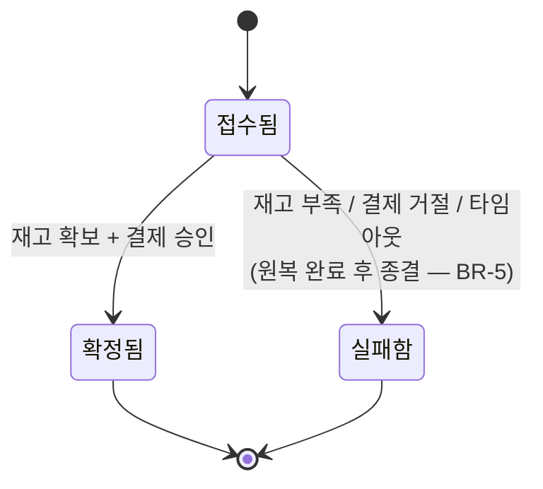

# 주문 처리 시스템 요구사항

> 이 문서는 구조를 어떻게 바꾸든 관찰 가능한 결과가 동일해야 한다는 전제 위에 쓰였다.
> 기능은 사흘이면 끝나지만, 비기능 요구사항이 아키텍처 결정을 강제한다.

---

## 1. 액터와 용어

### 1.1 액터

| 액터 | 설명 |
| --- | --- |
| **구매자** | 상품을 조회하고 주문을 넣는 유일한 사용자. 인증된 요청으로만 주문할 수 있다. |
| **운영자** | 상품과 재고 초기 데이터를 넣는 주체. 별도 화면 없이 초기 데이터로 대체한다. |
| **결제 대행** | 승인·취소를 응답하는 외부 시스템. 실제 연동 없이 규칙 기반으로 모사한다. |

### 1.2 용어

| 용어 | 정의 |
| --- | --- |
| **주문 접수** | 요청이 유효해 시스템이 받아들인 상태. 아직 확정은 아니다. |
| **주문 확정** | 재고가 확보되고 결제까지 승인된 최종 상태. |
| **재고 확보** | 해당 수량이 다른 주문에 쓰이지 않도록 붙잡아 둔 상태. |

---

## 2. 업무 규칙 (Business Rules)

기능보다 먼저 고정되는 것. 아래 규칙이 이 시스템의 전부다.

| ID | 규칙 |
| --- | --- |
| **BR-1** | 하나의 주문은 하나의 상품, 수량 1~10개만 담는다. |
| **BR-2** | 주문 금액은 `상품 가격 × 수량`이며 할인·배송비는 없다. |
| **BR-3** | 재고가 요청 수량보다 적으면 주문은 확정될 수 없다. |
| **BR-4** | 주문은 **접수됨 → 확정됨** 또는 **접수됨 → 실패함** 으로만 전이한다. 확정·실패는 종결 상태이며 되돌아가지 않는다. |
| **BR-5** | 주문이 실패하면 그 주문 때문에 줄어든 재고와 승인된 결제는 **원래대로 되돌아가야 한다.** 되돌리기가 끝나기 전에는 주문을 실패로 종결하지 않는다. |
| **BR-6** | 결제 대행은 금액이 100,000원 이상이면 거절한다. 실패 경로를 언제든 재현하기 위한 규칙이다. |
| **BR-7** | 어떤 시점에도 `상품 재고 + 확정된 주문의 수량 합`은 초기 재고와 같아야 한다. |

### 2.1 상태 전이 (BR-4)



---

## 3. 기능 요구사항 (FR)

| ID | 요구사항 | 수용 기준 |
| --- | --- | --- |
| **FR-01** | 상품 목록을 조회한다 | 이름·가격·재고 수량이 함께 반환된다 |
| **FR-02** | 상품 하나의 상세를 조회한다 | 없는 상품이면 404 |
| **FR-03** | 상품·수량으로 주문을 접수한다 | 유효한 요청은 주문 번호와 **접수됨** 상태를 즉시 반환한다 |
| **FR-04** | 주문 요청의 유효성을 검증한다 | 없는 상품, 수량 범위 밖(BR-1)이면 접수 자체가 거절된다 |
| **FR-05** | 접수된 주문에 대해 재고를 확보한다 | 재고 부족이면 주문은 **실패함**, 사유는 `OUT_OF_STOCK` |
| **FR-06** | 재고 확보 후 결제를 요청한다 | 거절되면 주문은 **실패함**, 사유는 `PAYMENT_DECLINED` |
| **FR-07** | 실패한 주문의 재고와 결제를 되돌린다 | 되돌린 뒤 재고는 주문 이전 값과 정확히 같다 (BR-5) |
| **FR-08** | 주문 하나를 조회한다 | 상태·금액·상품명·실패 사유가 함께 반환된다 |
| **FR-09** | 주문 목록을 조회한다 | 최신순, 상태로 필터 가능 |
| **FR-10** | 주문의 상태 변경 이력을 남긴다 | 언제 어떤 상태로, 왜 바뀌었는지 조회할 수 있다 |

---

## 4. 비기능 요구사항 (NFR)

이 문서에서 가장 중요한 절. **어떻게 만족시킬지는 설계 단계에서 정한다.**

| ID | 요구사항 | 검증 방법 |
| --- | --- | --- |
| **NFR-01** | 주문 접수 응답은 결제·재고 처리 완료를 기다리지 않는다 | 결제 처리에 3초 지연을 넣어도 접수 응답은 200ms 이내 |
| **NFR-02** | 같은 요청이 중복 전송돼도 주문은 한 건만 생성된다 | 동일 요청 식별자로 10회 호출 → 주문 1건 |
| **NFR-03** | 주문 처리가 어느 단계에서 끊겨도 재고 정합성은 깨지지 않는다 (BR-7) | 처리 도중 강제 종료 후 재기동 → 재고 합계 일치 |
| **NFR-04** | 주문 기능이 동작하지 않아도 상품 조회는 계속 가능하다 | 주문 처리 중단 상태에서 FR-01 정상 응답 |
| **NFR-05** | 결제 대행이 응답하지 않을 때 무한 대기하지 않는다 | 일정 시간 내 실패로 판정되고 FR-07이 수행된다 |
| **NFR-06** | 주문 한 건의 처리 과정을 처음부터 끝까지 추적할 수 있다 | 주문 번호로 모든 처리 로그가 하나로 이어진다 |
| **NFR-07** | 인증되지 않은 요청은 주문할 수 없다 | 토큰 없는 FR-03 요청은 401 |
| **NFR-08** | 상품 조회는 초당 100건을 처리한다 | 부하 도구로 60초간 측정, 오류율 0% |
| **NFR-09** | 전체 시스템을 로컬에서 명령 하나로 기동할 수 있다 | 초기화된 환경에서 실행 → 5분 내 시나리오 통과 |

---

## 5. 데이터 요구사항

개념 모델이다. **저장 방식과 물리 스키마는 설계 결정이다.**
필드를 늘리고 싶어지면, 그 필드가 어떤 요구사항을 만족시키는지 먼저 답한다.

### 상품

| 필드 | 비고 |
| --- | --- |
| 상품ID | 식별자 |
| 상품명 | |
| 가격 | |
| 재고수량 | BR-7의 좌변 |

### 주문

| 필드 | 비고 |
| --- | --- |
| 주문번호 | 식별자 |
| 요청식별자 | 중복 요청 판별 (NFR-02) |
| 상품ID | |
| 수량 | 1~10 (BR-1) |
| 주문금액 | 가격 × 수량 (BR-2) |
| 상태 | `접수됨` \| `확정됨` \| `실패함` |
| 실패사유 | `OUT_OF_STOCK` \| `PAYMENT_DECLINED` \| `TIMEOUT` (실패 시) |
| 접수시각 | |
| 종결시각 | |

### 결제

| 필드 | 비고 |
| --- | --- |
| 결제ID | 식별자 |
| 주문번호 | |
| 금액 | |
| 상태 | `승인됨` \| `거절됨` \| `취소됨` |

### 이력 (FR-10)

| 필드 | 비고 |
| --- | --- |
| 주문번호 | |
| 이전상태 | |
| 이후상태 | |
| 사유 | |
| 발생시각 | |

---

## 6. 시나리오

완료 기준이 되는 세 흐름. 구조를 어떻게 바꾸든 이 셋의 **관찰 가능한 결과는 동일해야 한다.**

### S1 — 정상 주문

```text
재고 10개, 가격 30,000원인 상품을 1개 주문한다
즉시 주문번호와 접수됨을 받는다
재고가 확보되고 결제가 승인된다
주문 조회 시 확정됨, 상품 재고는 9개
```

### S2 — 재고 부족

```text
재고 1개인 상품을 5개 주문한다
즉시 접수됨을 받는다
주문 조회 시 실패함 / OUT_OF_STOCK
재고는 여전히 1개, 결제 기록은 없다
```

### S3 — 결제 거절과 원복

```text
재고 10개, 가격 150,000원인 상품을 1개 주문한다 (BR-6)
즉시 접수됨을 받는다
재고가 확보됐다가 결제가 거절된다
주문 조회 시 실패함 / PAYMENT_DECLINED
재고는 10개로 원복, 이력에 확보와 원복이 모두 남는다
```

---

## 7. 완료 기준

- [ ] 기능 요구사항 10개가 모두 수용 기준대로 동작한다.
- [ ] 시나리오 S1·S2·S3가 자동 테스트로 검증된다.
- [ ] 비기능 요구사항 9개가 각자의 검증 방법으로 확인된다.
- [ ] BR-7(재고 정합성)이 어떤 실패 상황에서도 성립한다.
- [ ] **구조를 바꾼 뒤에도 위 네 항목이 그대로 통과한다 — 이것이 이 프로젝트의 진짜 목표다.**
